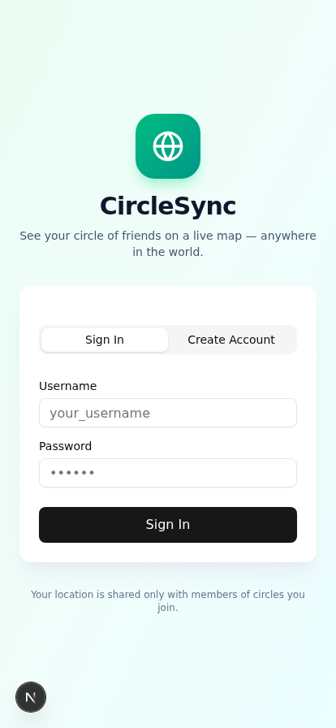

# CircleSync — Friend Location Tracker

A real-time location sharing app for your circle of friends. Create a circle, share the invite code, and see each other on a live map — anywhere in the world.

## What you got

| File | Description |
|------|-------------|
| `CircleSync.apk` | **Android APK installer** (30 KB) — install on any Android 7.0+ phone |
| `01-login.png` | Screenshot of the login / sign-up screen |
| `02-dashboard.png` | Screenshot of the circles dashboard |
| `03-map-live.png` | Screenshot of the live map with location sharing active |

## How to install the APK on Android

1. **Transfer the APK** to your Android phone (via download, email, WhatsApp, USB, etc.)
2. On your phone, **tap the APK file** in your file manager
3. If prompted, allow "Install from unknown sources" for your file manager
4. Tap **Install** → **Open**

> The APK is a thin native wrapper around the CircleSync web app. When you first launch it, you'll be asked for the **CircleSync server URL** — that's where your friends' location data lives.

## How to use CircleSync

### 1. First launch (APK)
Enter the **CircleSync server URL** on the first-launch screen. This is the URL of the deployed CircleSync backend (the same URL your friends will use). Talk to whoever set up the server, or use the deployment URL you were given.

### 2. Create an account
Tap **Create Account**, enter a username, display name, and password.

### 3. Create or join a circle
- **Create Circle** → give it a name → you'll get a **6-character invite code** (e.g. `63BAPQ`)
- **Join Circle** → enter a friend's 6-character invite code

### 4. Share your location
Inside a circle, tap **"Start sharing your location"**. Allow location permissions when prompted. Your avatar appears on the map; everyone else in the circle sees it too.

### 5. Invite friends
Tap the invite code in the top bar to **copy it**, then text it to your friends. They install the APK, enter the same server URL, sign up, and join your circle with the code.

## Features

- **Real-time location** — positions update live via WebSocket
- **Worldwide coverage** — works anywhere with internet, using OpenStreetMap
- **Friend circles** — invite-code based, only people you invite can see your location
- **Privacy-respecting** — sharing is opt-in; tap "Stop sharing" anytime to go invisible
- **Live presence** — see who's online and when they last updated
- **Mobile-first UI** — designed for phones, works on desktop too

## Alternative: PWA installation (no APK needed)

If you don't want to install the APK, you can install CircleSync as a **Progressive Web App** directly from the browser:

- **Android Chrome**: open the URL → ⋮ menu → **Install app**
- **iOS Safari**: open the URL → Share → **Add to Home Screen**
- **Desktop Chrome**: click the install icon in the address bar

The PWA gives you the same experience as the APK, but uses the browser's geolocation prompt instead.

## For developers

**Tech stack:**
- Frontend: Next.js 16 + React 19 + Tailwind + shadcn/ui
- Map: Leaflet + OpenStreetMap (no API key needed)
- Real-time: Socket.io (port 3003, routed via Caddy)
- Auth: Cookie-based session + bcrypt password hashing
- DB: Prisma + SQLite
- APK: Native Android WebView (Java), built with Android SDK 34

**APK build:** the manual build script lives at `/home/z/my-project/scripts/build-apk.sh` — it uses `aapt2`, `javac`, `d8`, `zipalign`, and `apksigner` directly (no Gradle needed).

## Privacy

- Your password is hashed with bcrypt before storage.
- Location is only shared with members of circles you've joined.
- Location updates are sent only while sharing is ON.
- Closing the app or tapping "Stop sharing" immediately removes you from the map.
